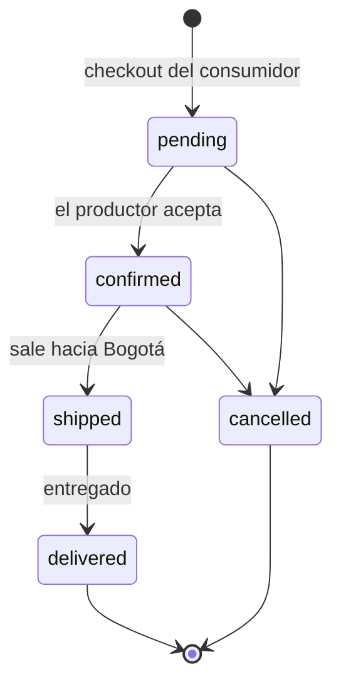

# Referencia de comportamiento — BioBoyacá

Documento **transversal** para desarrolladores: reúne en un solo sitio las reglas
que atraviesan varios módulos (permisos, ciclo de vida del pedido, dinero,
validaciones, seguridad) y los comportamientos que sorprenden al llegar nuevo.

Para el detalle de cada módulo por separado, ver [`modules/`](./modules/). Para la
arquitectura y las convenciones de código, ver [`../ARQUITECTURA.md`](../ARQUITECTURA.md).
Para el **recorrido de cada perfil** por el sistema en forma de diagrama, ver
[`FLUJOS.md`](./FLUJOS.md).

---

## 1. Puesta en marcha desde un clon

Verificado clonando el repositorio en limpio: **funciona sin pasos extra**, pese
a que `.gitignore` excluye la base de datos local, las imágenes subidas y `.env`.

```bash
git clone https://github.com/henrygomez-10/bio-boyaca.git
cd BioBoyaca

# 1. (Opcional) Datos de demostración. Ver el aviso de abajo.
php scripts/seed.php

# 2. Servidor de desarrollo. El último argumento es OBLIGATORIO: actúa como
#    router para que las rutas con id (/producto/{id}) funcionen.
php -S localhost:8000 -t public public/index.php
```

Por qué funciona un clon vacío:

| Ignorado por git | Qué pasa al clonar |
|---|---|
| `storage/data/*.json` | La carpeta existe gracias a `storage/data/.gitkeep`. `JsonDatabase` trata una colección inexistente como lista vacía y **crea el `.json` en la primera escritura**. La app arranca con catálogo vacío, sin errores. |
| `public/uploads/products/*` | La carpeta existe gracias a su `.gitkeep`. La primera subida escribe ahí sin más. |
| `.env` | **No es necesario.** `config/config.php` da valores por defecto a todo; las variables de entorno solo los sobrescriben. `.env.example` es documentación, no un requisito. |
| `vendor/` | No se usa. El autoloader PSR-4 es propio (`bootstrap.php`); Composer es opcional. |

Requisitos reales: **PHP >= 8.1** con `ext-json`. No hacen falta base de datos,
Composer ni la extensión **GD** (la validación de imágenes usa `getimagesize()`,
que es del núcleo).

> ⚠️ **No ejecutes `seed.php` con el servidor levantado.** El driver JSON hace
> *leer-modificar-escribir* del archivo completo y **no es concurrente**: si el
> servidor atiende una petición mientras el seed escribe, los datos se corrompen
> de forma silenciosa (pedidos duplicados, estados cambiados). Para el servidor,
> siembra y vuelve a levantarlo. Es una de las razones para migrar a Postgres o
> Mongo.

---

## 2. Rutas y control de acceso

Todas las rutas se registran en `routes/web.php`. El control real vive en el
controlador (`requireAuth()` / `requireRole()`), **nunca en la vista**: ocultar un
botón es presentación, no seguridad.

| Método | Ruta | Controlador | Acceso |
|---|---|---|---|
| GET | `/` | `HomeController@index` | Público |
| GET · POST | `/registro` | `AuthController@showRegister` · `register` | Público (redirige a `/` si ya hay sesión) |
| GET · POST | `/login` | `AuthController@showLogin` · `login` | Público (idem) |
| POST | `/logout` | `AuthController@logout` | Cualquiera |
| GET | `/catalogo` | `CatalogController@index` | Público |
| GET | `/producto/{id}` | `ProductController@show` | Público |
| GET | `/carrito` | `CartController@show` | **Público** (ver §5) |
| POST | `/carrito/agregar` | `CartController@add` | **Público** |
| POST | `/carrito/cantidad` | `CartController@updateQty` | **Público** |
| POST | `/carrito/eliminar` | `CartController@remove` | **Público** |
| POST | `/pedido` | `CartController@checkout` | Rol `consumer` |
| GET | `/consumidor` | `ConsumerController@dashboard` | Rol `consumer` |
| GET | `/consumidor/pedidos` | `ConsumerController@orders` | Rol `consumer` |
| GET | `/productor` | `ProducerController@dashboard` | Rol `producer` |
| GET | `/productor/productos` | `ProducerController@products` | Rol `producer` |
| GET | `/productor/productos/nuevo` | `ProducerController@createForm` | Rol `producer` |
| POST | `/productor/productos` | `ProducerController@store` | Rol `producer` |
| GET | `/productor/productos/{id}/editar` | `ProducerController@editForm` | Rol `producer` **+ propiedad** |
| POST | `/productor/productos/{id}` | `ProducerController@update` | Rol `producer` **+ propiedad** |
| POST | `/productor/productos/{id}/eliminar` | `ProducerController@destroy` | Rol `producer` **+ propiedad** |
| GET | `/productor/pedidos` | `ProducerController@orders` | Rol `producer` |
| POST | `/productor/pedidos/{id}/estado` | `ProducerController@updateOrderStatus` | Rol `producer` **+ propiedad** |
| GET | `/productor/billetera` | `ProducerController@wallet` | Rol `producer` |
| POST | `/productor/billetera/retiro` | `ProducerController@withdraw` | Rol `producer` |
| GET | `/admin` · `/admin/usuarios` · `/admin/productos` · `/admin/pedidos` | `AdminController@*` | Rol `admin` |

**Propiedad** significa una segunda comprobación, además del rol:

- `ownedProductOrFail()` — el producto debe existir (`404`) y ser del productor
  en sesión (`403`). Evita editar productos ajenos conociendo su id.
- `orderHasMyProduct()` — el productor solo toca pedidos que incluyan **al menos
  una línea suya**. Un pedido puede mezclar varios productores.

El panel de administración es **solo lectura**: muestra métricas y listados, pero
no edita ni borra nada.

---

## 3. Ciclo de vida del pedido

Cinco estados, en `App\Models\Order`:

| Constante | Valor | Etiqueta |
|---|---|---|
| `STATUS_PENDING` | `pending` | Pendiente |
| `STATUS_CONFIRMED` | `confirmed` | Confirmado |
| `STATUS_SHIPPED` | `shipped` | En tránsito |
| `STATUS_DELIVERED` | `delivered` | Entregado |
| `STATUS_CANCELLED` | `cancelled` | Cancelado |



Quién puede cambiarlo:

- **Consumidor**: crea el pedido en `pending` al confirmar el carrito. Después
  **no puede modificarlo ni cancelarlo**.
- **Productor**: es el único que cambia el estado, y solo en pedidos con producto
  suyo.
- **Admin**: no cambia estados (panel de solo lectura).

> ⚠️ **El flujo del diagrama es la intención, no una restricción del código.**
> `updateOrderStatus()` acepta **cualquiera** de los cinco estados: solo valida
> que el valor exista en `Order::statuses()`, no que la transición sea legal. Un
> productor puede saltar de `pending` a `delivered`, o retroceder de `delivered`
> a `pending`. Si el flujo importa, hay que añadir una máquina de estados
> explícita — hoy no existe.

Además, **cancelar no repone el stock**: el descuento ocurre en el checkout y no
se revierte en ningún momento.

---

## 4. Dinero: cómo se calcula todo

Toda la aritmética vive en `App\Models\Order` y en `ProducerController`. Ningún
importe se calcula en las vistas.

**Al crear el pedido** (`CartController::checkout`):

```
subtotal = Σ (precio_línea × cantidad)
shipping = 6.000  (tarifa plana; 0 si el carrito está vacío)
total    = subtotal + shipping
```

- `Order::SHIPPING_FEE` es una **tarifa plana por pedido**, no por producto ni por
  productor: da igual que el pedido lleve 1 o 10 artículos.
- Los tres importes se **guardan congelados** en el pedido. Si mañana cambia la
  tarifa, el histórico no se altera.
- Igual con `name` y `price` de cada línea: son una **foto del momento de la
  compra**, no se releen del producto (que puede haber cambiado de precio o
  haberse borrado).

> ⚠️ **`Order::computeTotal()` incluye el envío.** Antes del carrito devolvía solo
> la suma de líneas. Si necesitas el importe sin logística, usa
> `computeSubtotal()`.

**Ingresos del productor** (`ProducerController::wallet`) — la regla más
delicada del proyecto:

- Se suman **solo las líneas cuyo `producer_id` es suyo**, nunca el campo `total`
  del pedido. Un pedido puede mezclar productores, y la logística no le
  corresponde a ninguno: por eso el ingreso sale de las líneas, lo que
  naturalmente excluye el envío.
- **Ingresos del mes** (tarjeta principal): pedidos `delivered` del mes en curso.
- **Entregados / En tránsito** (contadores): del mes en curso; "en tránsito"
  agrupa `confirmed` + `shipped` (`Order::inTransitStatuses()`).
- **Gráfico semanal**: incluye `delivered` **y** en tránsito — es venta hecha
  aunque no esté cobrada. Reparto por día del mes: 1–7 → Sem 1, 8–14 → Sem 2,
  15–21 → Sem 3, 22+ → Sem 4.
- **Saldo disponible**: `delivered` de todos los tiempos − lo ya retirado.

Nota la asimetría deliberada: el **gráfico** cuenta lo que está en camino, pero
el **saldo retirable** solo lo entregado.

**Retiros** (`withdraw()`): son **simulados**. Se registra la solicitud en la
colección `withdrawals` y el saldo se descuenta, pero **no hay pasarela de pago
ni movimiento de dinero real**. El importe se recalcula siempre en el servidor
(nunca se confía en el formulario) y el retiro es **todo o nada**: siempre el
saldo disponible completo, no admite importes parciales.

---

## 5. Carrito

`App\Core\Cart` — vive en la **sesión**, no en la base de datos:

```php
$_SESSION['cart'] = ['<product_id>' => <cantidad:int>, ...];
```

Decisiones que conviene conocer:

- **Solo se guardan id y cantidad.** Nombre, precio y stock se re-resuelven contra
  el repositorio en cada pantalla, para que una subida de precio o una rotura de
  stock se vean **antes** de pagar.
- **Se puede llenar sin sesión iniciada.** La autenticación se exige únicamente
  en el checkout, para no cortar la navegación del catálogo. Por eso las rutas
  `/carrito/*` son públicas.
- Un producto que **desaparece** del catálogo se elimina del carrito
  silenciosamente al re-resolver las líneas.
- Máximo **99 unidades por línea**, como salvaguarda ante entradas absurdas.
- El stock se **revalida justo antes de cobrar**: entre llenar el carrito y pagar,
  otro consumidor puede haberse llevado las últimas unidades.
- Tras confirmar, el carrito se vacía y la dirección se guarda en el usuario para
  prellenar el siguiente pedido.

---

## 6. Reglas de validación

Todas son **de servidor**. Los `required` del HTML son ayuda de UX, no la defensa.

**Registro** (`Auth::register`)

| Campo | Regla |
|---|---|
| `name` | Obligatorio (no vacío tras `trim`) |
| `email` | `FILTER_VALIDATE_EMAIL` + **único**; se normaliza a minúsculas |
| `password` | Mínimo **6 caracteres**; se guarda con `password_hash` (bcrypt) |
| `role` | Solo `consumer` o `producer` — **`admin` no se crea por registro público** (solo por seed) |

**Producto** (`ProducerController::validateProduct`)

| Campo | Regla |
|---|---|
| `name` | Obligatorio |
| `category` | Debe estar en `Product::categories()` (8 valores) |
| `price` | **> 0** |
| `stock` | **>= 0** |
| `unit` | Debe estar en `Product::units()` |
| `origin` | Debe estar en `Product::origins()` (municipios de Boyacá) |
| `image` | Opcional. Ver abajo |

Categoría, unidad y origen son **listas cerradas** validadas contra el modelo: no
se acepta texto libre aunque el formulario se manipule.

**Imagen** (`App\Core\ImageUploader`)

- Máximo **2 MB**.
- El tipo se determina con **`getimagesize()`**, no por la extensión ni por el
  mime que declara el navegador. Permitidos: JPEG, PNG, WEBP, GIF.
- Se guarda con nombre aleatorio (`bin2hex(random_bytes(8))`) en
  `public/uploads/products/`; el producto solo almacena la ruta pública.
- Al reemplazar o borrar un producto, el archivo anterior se elimina del disco.

**Checkout** (`CartController::checkout`)

| Campo | Regla |
|---|---|
| `locality` | Debe estar en `Order::localities()` (localidades de Bogotá) |
| `address` | Obligatorio |
| Carrito | No puede estar vacío; cada línea revalida stock |

---

## 7. Seguridad transversal

- **CSRF en todo POST.** Se verifica globalmente en `public/index.php` con
  `hash_equals()` **antes** de enrutar. Si falla, corta con **`419`**. Todo
  formulario debe incluir `<?= csrf_field() ?>` (campo `_csrf`).
- **Contraseñas** con `password_hash` (bcrypt). La sesión guarda **solo el
  `user_id`**; el usuario se recarga del repositorio en cada petición.
- **Escapado de salida**: siempre `e()` en las vistas. Los mensajes flash también
  se escapan en el layout, así que se les pasa texto plano.
- **Redirección abierta**: el `return_to` del carrito solo se acepta si es una
  ruta interna (`safeReturnTo()` exige que empiece por `/` y no por `//`).
- **Superficie expuesta**: el document root es únicamente `public/`. `src/`,
  `config/` y `storage/` quedan fuera del alcance web.
- **Ids** generados con `bin2hex(random_bytes(8))`: sin puntos, para que un
  servidor no los confunda con archivos estáticos y las URLs queden limpias.

---

## 8. Datos y colecciones

Cinco colecciones (documentos, no tablas). El `DatabaseInterface` está diseñado
en términos de documentos para que el mapeo a Mongo sea casi 1:1; el equivalente
relacional está en [`../sql/schema.sql`](../sql/schema.sql).

| Colección | Campos propios del dominio |
|---|---|
| `users` | `name`, `email`, `password_hash`, `role`, `locality`, `address` |
| `products` | `producer_id`, `name`, `description`, `category`, `price`, `stock`, `unit`, `origin`, `image` |
| `orders` | `consumer_id`, `items[]`, `subtotal`, `shipping`, `total`, `locality`, `address`, `status` |
| `order.items[]` | `product_id`, `producer_id`, `name`, `price`, `qty`, `unit`, `origin` *(congelados)* |
| `withdrawals` | `producer_id`, `amount`, `status` (`requested`) |

Todo documento recibe además `id` y `created_at` en la inserción.

> Los pedidos anteriores al carrito pueden **no tener** `subtotal`, `shipping`,
> `locality` ni `address`. Las vistas lo contemplan (`isset()` antes de pintar el
> desglose); tenlo en cuenta al escribir código nuevo sobre `orders`.

---

## 9. Comportamientos que sorprenden

Resumen de las trampas, todas explicadas arriba:

1. **Sembrar con el servidor levantado corrompe los datos** (driver JSON no
   concurrente). §1
2. **`computeTotal()` incluye el envío**; para el importe sin logística usa
   `computeSubtotal()`. §4
3. **Los ingresos del productor no salen de `order['total']`**, sino de sus
   propias líneas. §4
4. **El carrito funciona sin sesión**; el login se exige solo al pagar. §5
5. **No hay máquina de estados**: cualquier estado puede pasar a cualquier otro. §3
6. **Cancelar un pedido no repone el stock.** §3
7. **Los retiros son simulados**, y siempre del saldo completo. §4
8. **El panel de admin es de solo lectura.** §2
9. **Los pedidos antiguos pueden carecer de campos** del desglose económico. §8
