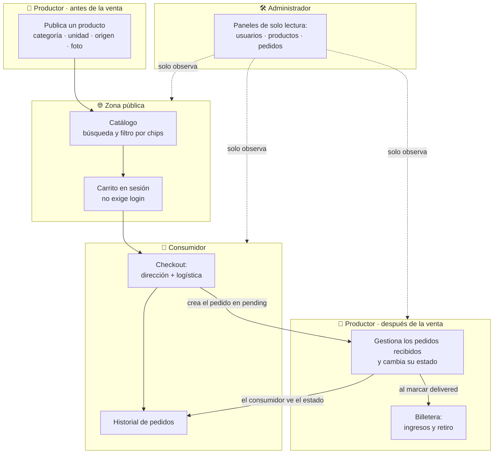
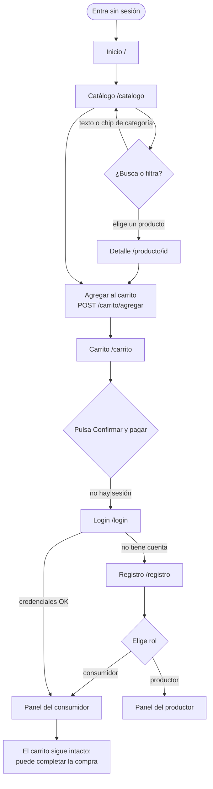
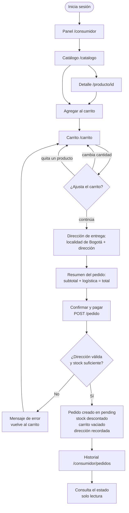
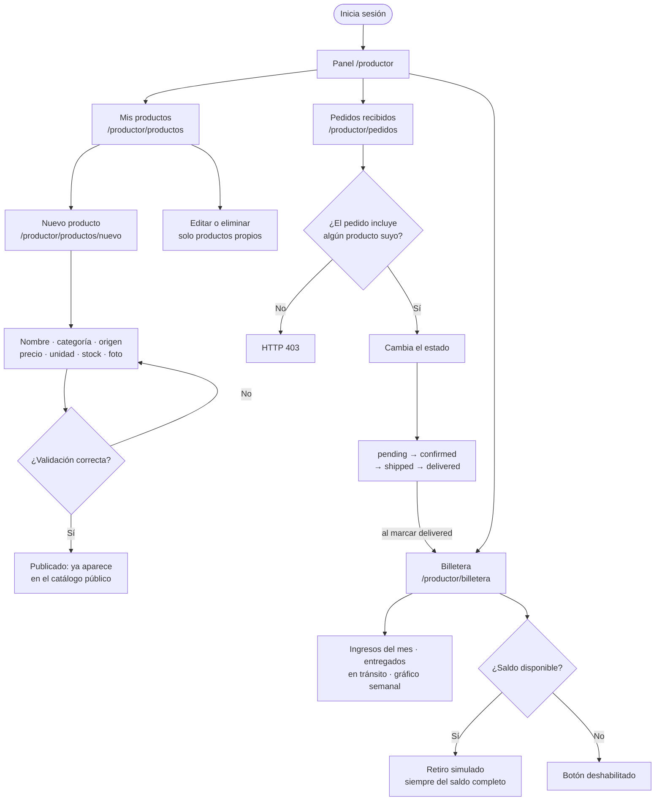
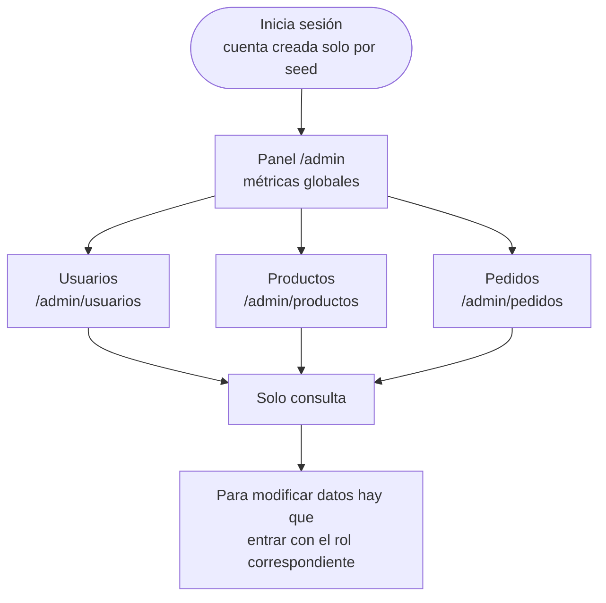

# Diagramas de flujo por perfil — BioBoyacá

Recorridos de cada tipo de usuario a través del sistema. Los diagramas reflejan
las rutas reales de `routes/web.php` y las reglas verificadas en los
controladores; para el detalle de permisos y reglas de negocio, ver
[`COMPORTAMIENTO.md`](./COMPORTAMIENTO.md).

Hay cuatro perfiles: **visitante** (sin sesión), **consumidor**, **productor** y
**administrador**.

---

## 1. Visión general: el ciclo comercial

Cómo encajan los perfiles entre sí. El productor publica, el consumidor compra,
el productor cumple y cobra; el administrador solo observa.

> El dinero se reparte así: el **subtotal de cada línea** va al productor dueño de
> ese producto; la **logística** ($6.000 por pedido) no le corresponde a ninguno.
> Por eso la billetera nunca suma el `total` del pedido. Ver
> [COMPORTAMIENTO §4](./COMPORTAMIENTO.md#4-dinero-cómo-se-calcula-todo).

---

## 2. Visitante (sin sesión)

Puede navegar y **llenar el carrito sin registrarse**. La sesión solo se exige al
pagar, para no cortar la navegación. Como el carrito vive en `$_SESSION`,
**sobrevive al login**: lo que agregó como invitado sigue ahí al volver.

> El rol **administrador no se puede crear por registro público**: solo lo genera
> `scripts/seed.php`.

---

## 3. Consumidor

Compra y consulta. Una vez creado el pedido, **no puede modificarlo ni
cancelarlo**: el estado lo gobierna el productor.

Detalles que importan:

- El **stock se revalida justo antes de cobrar**: entre llenar el carrito y pagar,
  otro consumidor puede haberse llevado las últimas unidades.
- Nombre y precio de cada línea se **congelan** en el pedido; si el productor los
  cambia después, el histórico no se altera.
- La dirección se guarda en el usuario para **prellenar** el siguiente checkout.

---

## 4. Productor

Publica su producción, gestiona los pedidos que la incluyen y cobra. Todas sus
acciones sobre un producto o pedido concreto comprueban además la **propiedad**:
no basta con tener el rol.

> ⚠️ El flujo `pending → confirmed → shipped → delivered` es la **intención, no una
> restricción**: `updateOrderStatus()` acepta cualquiera de los cinco estados sin
> validar la transición. Y **cancelar no repone el stock**. Ver
> [COMPORTAMIENTO §3](./COMPORTAMIENTO.md#3-ciclo-de-vida-del-pedido).

---

## 5. Administrador

Perfil de **supervisión, no de gestión**. Los cuatro paneles son de solo lectura:
no crea, edita ni borra nada, y tampoco cambia estados de pedidos.

---

## 6. Qué protege cada flujo

Todo lo anterior se apoya en las mismas defensas, aplicadas en el **controlador**,
nunca en la vista (ocultar un botón es presentación, no seguridad):

| Control | Dónde | Efecto |
|---|---|---|
| CSRF en todo POST | `public/index.php`, antes de enrutar | `419` si el token no coincide |
| `requireAuth()` | Controlador base | Redirige a `/login` |
| `requireRole()` | Cada acción protegida | `403` con `errors/403` |
| `ownedProductOrFail()` | Productos del productor | `404` si no existe, `403` si es ajeno |
| `orderHasMyProduct()` | Pedidos del productor | `403` si el pedido no lleva nada suyo |
| `safeReturnTo()` | Carrito | Impide redirección abierta fuera del sitio |

El diagrama del **flujo interno de una petición** (front controller → router →
controlador → vista) está en
[`modules/README.md`](./modules/README.md#diagrama-del-flujo-de-una-petición).
