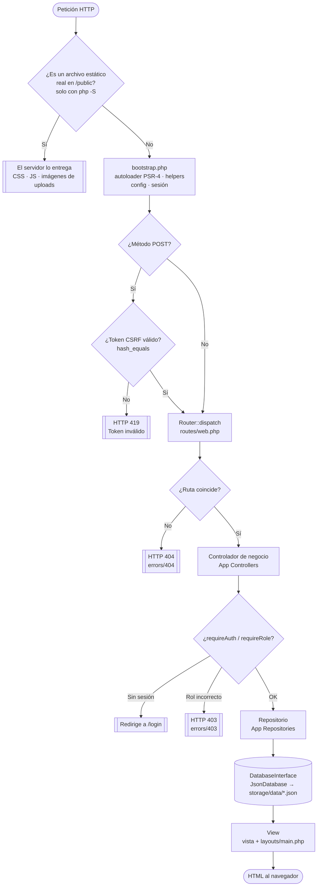
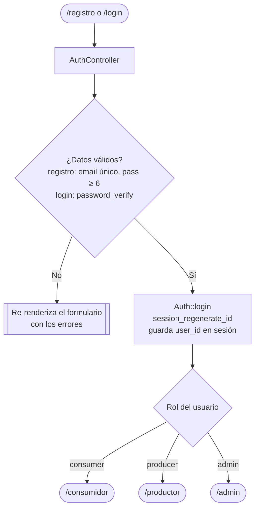
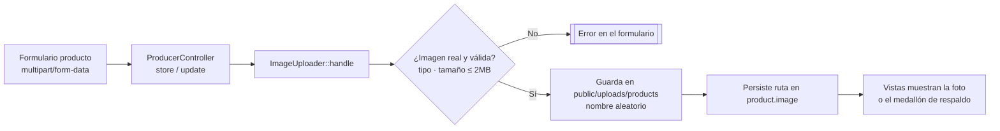
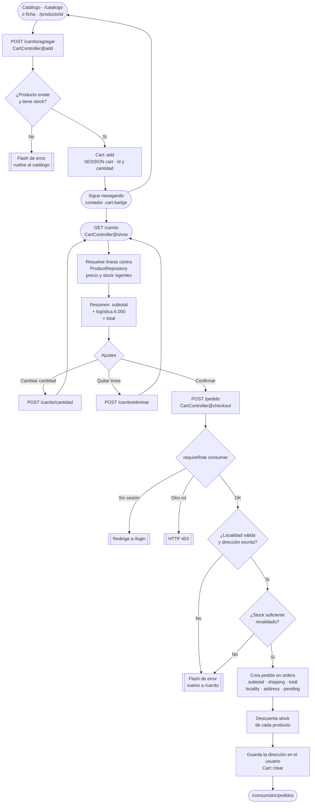

# Documentación de módulos — BioBoyacá

> **BioBoyacá** — *Del campo boyacense a tu mesa en Bogotá*. El nombre y el lema se definen en `config/config.php` → `config['app']['name']` y `config['app']['tagline']` (o la variable de entorno `APP_NAME`). **No se hardcodean** en vistas ni controladores: se usa siempre `$appName` / `$tagline`.

Índice de documentación por módulo. Cada archivo describe propósito, rutas, archivos involucrados, datos/colecciones, reglas de negocio, control de acceso y mejoras futuras.

## Índice

| Módulo | Documento | Resumen |
|---|---|---|
| Inicio | [`inicio.md`](./inicio.md) | Landing pública con productos destacados. |
| Autenticación | [`autenticacion.md`](./autenticacion.md) | Registro, login, logout, roles y seguridad de contraseñas. |
| Catálogo | [`catalogo.md`](./catalogo.md) | Listado público de productos con búsqueda y filtro por categoría. |
| Detalle de producto | [`producto.md`](./producto.md) | Ficha de un producto y punto de entrada al carrito. |
| Carrito y checkout | [`carrito.md`](./carrito.md) | Carrito en sesión, resumen del pedido, dirección de entrega y confirmación de compra. |
| Perfil del productor | [`productor.md`](./productor.md) | CRUD de productos propios y gestión de estado de pedidos recibidos. |
| Billetera del productor | [`billetera.md`](./billetera.md) | Ingresos por ventas, gráfico semanal y retiro de fondos (simulado). |
| Perfil del consumidor | [`consumidor.md`](./consumidor.md) | Panel del consumidor e historial de pedidos. |
| Administración | [`administracion.md`](./administracion.md) | Panel de solo-consulta: métricas y listados globales. |
| Núcleo (Core) | [`core.md`](./core.md) | Router, Controller base, View, Container, Auth, `Cart`, `ImageUploader`, helpers, capa de BD y repositorios. |

> 🔀 **Diagramas de flujo por perfil** (visitante, consumidor, productor, administrador y vista general del ciclo comercial): [`../FLUJOS.md`](../FLUJOS.md).
>
> 🧭 **Reglas transversales** (permisos por ruta y rol, ciclo de vida del pedido, cálculo del dinero, validaciones, seguridad y comportamientos que sorprenden): [`../COMPORTAMIENTO.md`](../COMPORTAMIENTO.md). Los documentos de este índice cubren cada módulo por separado; ese reúne lo que los atraviesa.
>
> 📋 Historial de cambios del proyecto: [`../CHANGELOG.md`](../CHANGELOG.md).

## Arquitectura general

Marketplace que conecta productores campesinos de Boyacá con consumidores de Bogotá. PHP puro, patrón MVC, sin framework, sin dependencias externas obligatorias (funciona con o sin Composer).

```
public/index.php  (front controller, único punto de entrada HTTP)
  └─ bootstrap.php          (autoloader PSR-4 propio, config, sesión)
       └─ App\Core\Container  (config + servicios compartidos: db(), auth())
            └─ App\Core\Router
                 └─ routes/web.php   (registro de todas las rutas)
                 └─ dispatch()  →  Controlador ("App\Controllers\*")
                      └─ App\Core\Controller (base: render, redirect, input,
                                               requireAuth, requireRole, flash)
                           └─ App\Core\Cart (carrito en $_SESSION['cart'])
                           └─ App\Repositories\* (Base/User/Product/Order/Withdrawal)
                                └─ App\Core\Database\DatabaseInterface
                                     ├─ JsonDatabase   (ACTIVO: storage/data/*.json)
                                     ├─ PostgresDatabase (stub, no implementado)
                                     └─ MongoDatabase    (stub, no implementado)
                      └─ App\Core\View → src/Views/**/*.php
                                       → src/Views/layouts/main.php
```

### Flujo de una petición

1. El servidor apunta su document root a `public/`; toda petición entra por `public/index.php`. **Bajo el servidor embebido de PHP** (`php -S ... public/index.php`), `index.php` primero comprueba si la URL corresponde a un **archivo estático real** dentro de `public/` (CSS, JS, imágenes de `uploads/`) y, de ser así, hace `return false` para que el servidor lo entregue tal cual — el resto se enruta.
2. `bootstrap.php` define `BASE_PATH`, registra el autoloader (`App\` → `src/`), carga `config/config.php`, ajusta zona horaria/errores y arranca la sesión.
3. `public/index.php` crea el `Container` (con la config) y el `Router`, y carga `routes/web.php`, que registra todas las rutas sobre el `Router`.
4. `Router::dispatch(method, uri)` busca la primera ruta cuyo método y patrón coincidan (soporta parámetros `{id}` vía regex con nombre), instancia el controlador (`App\Controllers\{Clase}`) pasándole el `Container`, y llama al método de acción con los parámetros de la URL.
5. El controlador (que extiende `App\Core\Controller`) valida acceso (`requireAuth()` / `requireRole()`), obtiene datos a través de Repositorios (`App\Repositories\*`, nunca del driver de BD directamente) y llama a `render()`.
6. `App\Core\View` incluye la vista PHP correspondiente (`src/Views/**`), inyecta variables comunes (`appName`, `tagline`, `roles`, `auth`, `title`) y, salvo que se pida lo contrario, envuelve el resultado en el layout `src/Views/layouts/main.php`.
7. Si ninguna ruta coincide, el `Router` responde `404` directamente con `errors/404`. Si el rol no es válido para una ruta protegida, el controlador responde `403` con `errors/403`.

#### Diagrama del flujo de una petición



#### Diagrama del registro / inicio de sesión y redirección por rol



### Persistencia intercambiable

`App\Core\Database\DatabaseInterface` define un contrato orientado a colecciones/documentos (`all`, `find`, `where`, `insert`, `update`, `delete`) implementado hoy por `JsonDatabase` (activo, guarda cada colección — `users`, `products`, `orders` — en un archivo `storage/data/{colección}.json`). `PostgresDatabase` y `MongoDatabase` son *stubs* preparados pero no funcionales todavía. El driver se selecciona en `config['database']['driver']` (env `DB_DRIVER`) y se instancia vía `App\Core\Database\DatabaseFactory`. Los controladores solo conocen los Repositorios (`App\Repositories\*`), nunca el driver.

### Autenticación y roles

Autenticación por sesión (`App\Core\Auth`), contraseñas con `password_hash`/`password_verify` (bcrypt). Tres roles: `consumer`, `producer`, `admin` (constantes en `App\Models\User`). El registro público solo permite crear `consumer` o `producer`; el rol `admin` se crea manualmente (ver `scripts/seed.php`).

### Colecciones de datos

| Colección | Repositorio | Contenido |
|---|---|---|
| `users` | `UserRepository` | Cuentas de consumidores, productores y administradores. Guarda además la última dirección de entrega usada (`locality`, `address`) para prellenar el checkout. |
| `products` | `ProductRepository` | Productos publicados por productores. Incluye `unit` (unidad de venta), `origin` (municipio de Boyacá) y el campo opcional `image` (ruta pública a la foto subida). |
| `orders` | `OrderRepository` | Pedidos realizados por consumidores (líneas `items[]`) con su desglose económico congelado (`subtotal`, `shipping`, `total`) y la dirección de entrega (`locality`, `address`). |
| `withdrawals` | `WithdrawalRepository` | Solicitudes de retiro de fondos de la billetera del productor. **Simuladas**: no hay pasarela de pago. |

El **carrito no es una colección**: vive en `$_SESSION['cart']` como un mapa `product_id => qty` y solo se convierte en un documento de `orders` cuando el consumidor confirma el pedido. Ver [`carrito.md`](./carrito.md).

### Subida de imágenes de producto

Los productores pueden adjuntar una **imagen opcional** a cada producto. La lógica vive en `App\Core\ImageUploader` (no en el controlador): valida que el archivo sea una imagen real (`getimagesize`, no confía en la extensión/mime del navegador), lista blanca **JPG/PNG/WEBP/GIF**, máximo **2 MB**, y la guarda con nombre aleatorio en `public/uploads/products/`. En el producto se persiste la ruta pública en el campo `image`. Al reemplazar o eliminar un producto se borra el archivo anterior para no dejar huérfanos. Las vistas muestran la foto (`object-fit: cover`) o, si no hay imagen, el medallón con la inicial como respaldo. Detalle en [`productor.md`](./productor.md).



### Flujo de compra (catálogo → carrito → checkout → pedido)

El flujo de compra ya **no** es "un producto = un pedido": pasa por un carrito en sesión que admite varias líneas. El carrito se puede llenar **como invitado**; la sesión con rol `consumer` solo se exige al confirmar.



### Interfaz: identidad verde, temas claro/oscuro y navegación

- **Sistema de diseño por tokens** en `public/assets/css/style.css`. La identidad es un **verde institucional** sobre un lienzo casi blanco levemente verdoso, para que la fotografía del producto sea la protagonista del color:

  | Token | Valor | Uso |
  |---|---|---|
  | `--verde` | `#1B7A4B` | Verde de marca (5.1:1 sobre `--bg`). |
  | `--verde-solido` | `#15633C` | Botones sólidos, encabezado y superficies con texto blanco (7.3:1). |
  | `--verde-hover` | `#0F4D2E` | Hover de botones sólidos y de enlaces. |
  | `--verde-suave` | `#E6F2EB` | Fondos de acento y zonas destacadas. |
  | `--ambar` | `#C8860D` | Avisos, "en tránsito" y ofertas — **siempre** con texto oscuro. |
  | `--ambar-texto` | `#96650A` | Variante para texto pequeño sobre fondo claro (5.0:1). |
  | `--bg` / `--card-bg` / `--fg` | `#F7F9F8` / `#FFFFFF` / `#1E2A24` | Alias funcionales de superficie y tinta. |

- **La paleta de marca es constante**: los tokens de marca (chips de categoría, insignias de estado, botón de acento) **no** se reasignan en oscuro — son "etiquetas impresas", no superficies. El tema oscuro **recalibrado** solo reasigna los *alias funcionales*: `--bg: #141A17`, `--card-bg: #1B2320`, `--fg: #E6EDE9`, `--border: #2C3733`, y aclara el primario a `--primary: #34A76B` (5.8:1) y el ámbar a `#E8A93A` (7.7:1) para mantener AA sobre fondo oscuro.
- **Tema claro por defecto**; el **modo oscuro es opcional** vía `:root[data-theme="dark"]`, activado por un botón en el encabezado (`#themeToggle`). La preferencia se guarda en `localStorage` (`tema`) y se aplica temprano desde el `<head>` para evitar parpadeos. Contraste AA verificado en ambos temas.
- **Breakpoints** (mobile-first, tres tramos reales): móvil `≤720px`, tablet `721–1024px`, escritorio `>1024px` (con un ajuste extra a partir de `1600px`). La navegación inferior se muestra solo en el tramo móvil.
- **Componentes destacados**: `.chips`/`.chip` (filtro de categoría con scroll horizontal), `.bottom-nav` (navegación inferior móvil), `.cart-badge` (contador del carrito), `.cart-item` y `.summary` (líneas y desglose del carrito), `.address-box` (dirección de entrega), `.wallet-hero`, `.stat-grid` y `.chart` (billetera del productor), `.camera-field` (campo de foto con cámara). Chips de categoría coloreados vía `.tag[data-cat="..."]` (`lacteos`, `huevos`, `carne`, `miel`, `tuberculos`, `hortalizas`, `cafe`, `arepas`) y badges de estado de pedido diferenciados.
- **Navegación doble**: barra superior con icono de carrito y contador (`Cart::count()`), y navegación inferior fija **solo en móvil** cuyos ítems cambian según el rol — el productor ve Panel / Productos / Pedidos / Billetera; el resto ve Inicio / Catálogo / Carrito / Mi cuenta.
- **Menú superior colapsable** (≤720px): los enlaces de `.main-nav` se pliegan tras el botón `#navToggle`; el carrito y el conmutador de tema quedan fuera del `<nav>` (en `.header-actions`) para seguir accesibles con el menú cerrado. Se cierra con Escape o tocando fuera. Como es mejora progresiva (condicionada a `html.js`), sin JavaScript el menú permanece desplegado.
- **Cache-busting**: el layout añade `?v=<filemtime>` a `style.css` y `main.js` para que el navegador recargue los assets cuando cambian.

### Advertencias / notas (ver detalle en cada módulo)

- `PostgresDatabase` y `MongoDatabase` son stubs: cambiar `DB_DRIVER` a `postgres` o `mongo` hoy lanzaría excepciones "no implementado" en cada método. Ver `docs/db/postgres.md` y `docs/db/mongo-cluster.md`.
- El driver JSON no está pensado para concurrencia alta; es solo para desarrollo local.

> Nota: dos hallazgos detectados durante la documentación ya fueron **corregidos**:
> (1) la **verificación CSRF server-side** ahora se aplica globalmente a todo POST en
> `public/index.php`; (2) `ProducerController::updateOrderStatus` ahora **sí verifica
> la propiedad** del pedido antes de cambiar su estado.
